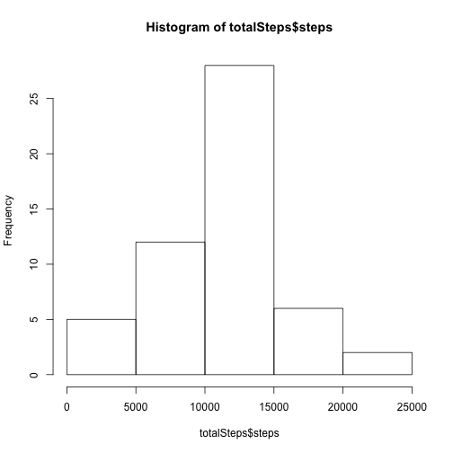
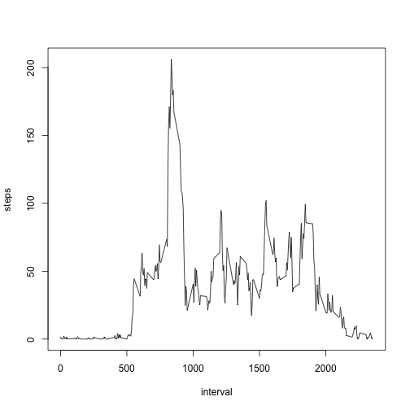
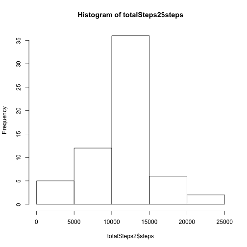
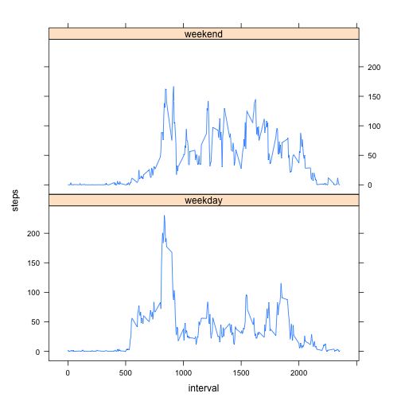

Reproducible Research: Peer Assessment 1
========================================================


Loading the data
----------------

Load the data

```r
## unzip the dataset archive and read the entire dateset
unzip(zipfile = "repdata_data_activity.zip", files = "activity.csv")
rawdata <- read.csv(file = "activity.csv")
```

What is mean total number of steps taken per day?
-------------------------------------------------


Calculate the total number of steps taken per day

```r
totalSteps<-aggregate(steps~date,data=rawdata,sum,na.rm=TRUE)
```

Make a histogram of the total number of steps taken each day

```r
hist(totalSteps$steps)
```



Calculate and report the mean and median of the total number of steps taken per day

```r
mean(totalSteps$steps)
```

```
## [1] 10766.19
```

```r
median(totalSteps$steps)
```

```
## [1] 10765
```

The **mean** total number of steps taken per day is
    1.0766189 &times; 10<sup>4</sup> steps.
The **median** total number of steps taken per day is
    10765 steps.

What is the average daily activity pattern?
-------------------------------------------

Make a time series plot (i.e. type = "l") of the 5-minute interval (x-axis) and the average number of steps taken, averaged across all days (y-axis)


```r
stepsInt<-aggregate(steps~interval,data=rawdata,mean,na.rm=TRUE)
plot(steps~interval,data=stepsInt,type="l")
```



Which 5-minute interval, on average across all the days in the dataset, contains the maximum number of steps?

```r
stepsInt[which.max(stepsInt$steps),]$interval
```

```
## [1] 835
```

The interval is is the **835th** interval.

Imputing missing values
-----------------------

Calculate and report the total number of missing values in the dataset (i.e. the total number of rows with \color{red}{\verb|NA|}NAs)


```r
sum(is.na(rawdata$steps))
```

```
## [1] 2304
```

Total 2304 rows are missing.

Devise a strategy for filling in all of the missing values in the dataset.

Using the mean for that 5-minute interva, I made a function **"intTosteps"**


```r
intTosteps<-function(interval){
    stepsInt[stepsInt$interval==interval,]$steps
}
```

Create a new dataset that is equal to the original dataset but with the missing data filled in.


```r
filled<-rawdata  # Make a new dataset with the original data
count=0           # Count the number of data filled in
for(i in 1:nrow(filled)){
    if(is.na(filled[i,]$steps)){
        filled[i,]$steps<-intTosteps(filled[i,]$interval)
        count=count+1
    }
}
cat("Total ",count, "NA values were filled.\n\r")  
```

```
## Total  2304 NA values were filled.
## 
```

Make a histogram of the total number of steps taken each day and Calculate and report the mean and median total number of steps taken per day.


```r
totalSteps2<-aggregate(steps~date,data=filled,sum)
hist(totalSteps2$steps)
```



```r
mean(totalSteps2$steps)
```

```
## [1] 10766.19
```

```r
median(totalSteps2$steps)
```

```
## [1] 10766.19
```
The **mean** total number of steps taken per day is
1.0766189 &times; 10<sup>4</sup> steps.

The **median** total number of steps taken per day is
1.0766189 &times; 10<sup>4</sup> steps.

Do these values differ from the estimates from the first part of the assignment? What is the impact of imputing missing data on the estimates of the total daily number of steps?

The **mean** value is the **same** as the value earlier because we use the mean value for that particular 5-min interval. The median value shows **a little** difference.


Are there differences in activity patterns between weekdays and weekends?
---------------------------------------------------------------------------

Create a new factor variable in the dataset with two levels – “weekday” and “weekend” indicating whether a given date is a weekday or weekend day.


```r
filled$day=ifelse(as.POSIXlt(as.Date(filled$date))$wday%%6==0, "weekend","weekday")
# For Sunday and Saturday : weekend, Other days : weekday
filled$day=factor(filled$day, levels=c("weekday","weekend"))
```

Make a panel plot containing a time series plot (i.e. \color{red}{\verb|type = "l"|}type = "l") of the 5-minute interval (x-axis) and the average number of steps taken, averaged across all weekday days or weekend days (y-axis).


```r
stepsInt2=aggregate(steps~interval+day,filled,mean)
library(lattice)
xyplot(steps~interval|factor(day),data=stepsInt2,aspect=1/2,type="l")
```


